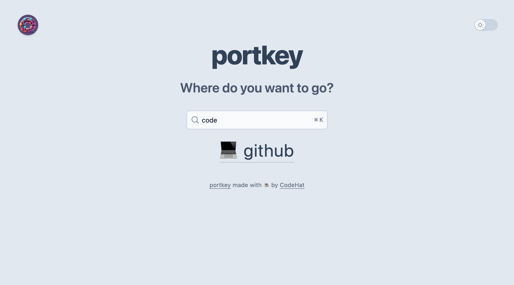
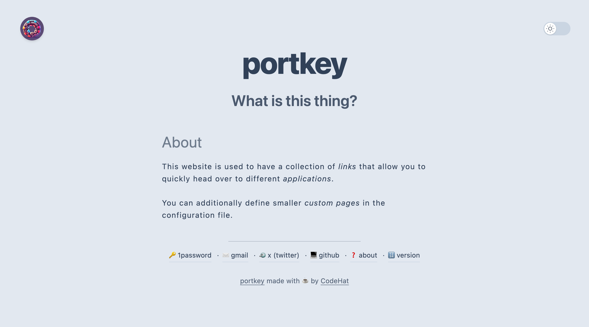

<p align="center"></p>

<h1 align="center">portkey</h1>
<div align="center">
  ⚡🚀🔗
</div>
<div align="center">
  <strong>Repository of the portkey application</strong>
</div>
<div align="center">
  A simple web portal that can act as startup page and shows a collection of links/urls. It also supports adding small custom pages.
</div>

<br />

<div align="center">
  <!-- Sonar quality gate -->
  <a href="https://sonarcloud.io/project/overview?id=kodehat_portkey">
    
  </a>
  <!-- GitHub stars -->
  <a href="https://github.com/kodehat/portkey">
    
  </a>
  <!-- Go version -->
  
  <!-- Docker image size -->
  <a href="https://hub.docker.com/r/codehat/portkey">
    
  </a>
</div>

<div align="center">
  <h3>
    <a href="https://www.portkey.page">
      Website (GitHub)
    </a>
    <span> | </span>
    <a href="https://github.com/kodehat/portkey/blob/main/.github/CONTRIBUTING.md">
      Contributing
    </a>
  </h3>
</div>

<div align="center">
  <sub>As magical as in Harry Potter. Built with ☕️ by
  <a href="https://www.codehat.de">CodeHat</a> and
  <a href="https://github.com/kodehat/portkey/graphs/contributors">
    contributors
  </a>
</div>

## Table of Contents

- [Features](#features)
- [Screenshots](#screenshots)
- [Installation](#installation)
- [Usage](#usage)
- [Configuration](#configuration)
- [Metrics](#metrics)
- [Docker](#docker)
- [Development](#development)
- [See Also](#see-also)
- [License](#license)

## Features

- 🔗 Shows a collection of links acting as startup page or similiar.
- 🔎 Includes a search box with configurable keyword support.
- 📄 Can be configured easily by modifying only one file.
- 🗒️ Also supports adding smaller custom pages.
- 🌓 Dark and light mode available.
- 🪰 Very lightweight application with Docker images available.

## Screenshots

<p>You can also find a demo <a href="https://demo.portkey.page">here</a></p>

<details>

  <summary>Click to view screenshots</summary>

  #### Link collection

  
  
  #### Search for a link

  

  #### Custom page
  
  

</details>

## Installation

Download the `portkey` file for your OS. Probably to a location that is in your `PATH`, so you can use it right away. 

## Usage

1. Create a `config.yml` or use the [example configuration](https://github.com/kodehat/portkey/blob/main/config.yml) from this repository and configure it as you want.
> You can find a detailed explanation of all configuration options [here](#configuration).
2. Start the application with `portkey --config-path=<path_to_config_yml>`. Providing the path to the configuration file is optional if it's in the working directory.
3. Open browser at defined host and port. Default is <http://localhost:3000>

## Configuration

The `config.yml` contains the following configuration options:

### Server

```yaml
# Can be changed to reduce or increase logs. Values could be "ERROR", "WARN", "INFO" (default) or "DEBUG.
logLevel: INFO
# If enabled logs are in JSON format.
logJson: false
# Set the host where the application should bind to.
host: localhost
# Set the port where the application should bind to.
port: 1414
# Set the context path (aka base-url) portkey is hosted under. Must not be specified unless you're using a reverse proxy and are hosting portkey under a directory. If that's the case then you can set this value to e.g. /portkey or whatever the directory is called. Note that the forward slash (/) in the beginning is required!
contextPath: ""
# Enables the HTTP server that serves metrics that can be scraped by e.g. Prometheus.
enableMetrics: false
# Set the host where the metrics server should bind to.
metricsHost: localhost
# Set the port where the metrics server should bind to.
metricsPort: 1515
```

### Styling

```yaml
# Title of the application shown in the browser tab and on the front page.
title: "portkey"
# Allows to hide the title.
hideTitle: false
# Allows adding additional scripts/stylesheets etc. to the HTML header. Can be useful for analytics or smaller style modifications.
headerAddition: |-
  <script async src="https://analytics.example.com"></script>
# Footer (HTML support) that is shown on every page.
# Remember that Tailwind CSS classes used here do only work if already used somewhere else in the application because the bundler couldn't look here!
footer: |-
  <p>This is a footer!</p>
# Defines whether portkey's application icon should be shown at the top left of the front page.
showTopIcon: true
# If true keywords of portals are shown as tooltip on hover.
showKeywordsAsTooltips: false
# If true all links are sorted alphabetically when shown on the front page. Otherwise they are shown in the order they are defined.
sortAlphabetically: false
# If true search query is also compared to portals and keywords using Levenshtein string metric.
searchWithStringSimilarity: false
# Minimum required similarity for results when 'searchWithStringSimilarity' is 'true'. Must be between '0.0' (0%) and '1.0' (100%).
minimumStringSimilarity: 0.5
```

### Portals (Links)

```yaml
# Defines a list of portals (links) that have additional attributes defining their appearance.
portals:
  # Name of the link
- title: example
  # (Optional) An emoji shown in front of the title.
  emoji: 🔗
  # Link where the portal will lead to (can be relative for custom pages or absolute otherwise)
  link: https://example.com/
  # If the link configured for this portal opens an external url or a relative one.
  external: true
  # Additional keywords used by the search feature.
  keywords:
  - url
  - example
```

### Custom pages

```yaml
# Defines a list of custom pages that are made available at the defined paths.
# Important: These are not automatically added to the list of portals and have to be added manually!
# This may be changed in the future.
pages:
  # Heading for the custom page. Shown in browser tab and as heading on the page.
- heading: Custom
  # Path where the custom page will be available.
  path: /custom
  # Content of the custom page and it supports using HTML.
  # The same CSS rules apply as for the footer!
  content: |-
    This is a <em>custom page</em></br>
    It also supports using <strong>HTML</strong>!
```

## Metrics

Metrics can be enabled with the `enableMetrics` configuration key and are served on a dedicated HTTP server. By default they are served on `http://localhost:1515/metrics`. Use this address to configure your tool of choice (e.g. [Prometheus](https://prometheus.io/)) to scrape the exported metrics.

Besides the default metrics provided by the [Prometheus instrumentation library for Go applications ](https://github.com/prometheus/client_golang), the following additional metrics are provided:

```plain
# HELP portkey_page_handler_requests_total Total number of HTTP requests by page.
# TYPE portkey_page_handler_requests_total counter
portkey_page_handler_requests_total{path="<page_path>"} 0

# HELP portkey_portal_handler_requests_total Total number of HTTP requests by portal.
# TYPE portkey_portal_handler_requests_total counter
portkey_portal_handler_requests_total{portal="<portal_title>"} 0

# HELP portkey_search_requests_no_results_total Total number of HTTP requests for search with no results.
# TYPE portkey_search_requests_no_results_total counter
portkey_search_requests_no_results_total 0

# HELP portkey_search_requests_with_results_total Total number of HTTP requests for search with at least one result.
# TYPE portkey_search_requests_with_results_total counter
portkey_search_requests_with_results_total 0

# HELP portkey_version_info Version information about portkey.
# TYPE portkey_version_info gauge
portkey_version_info{buildTime="2024.10.09_17:29:19",commitHash="4fd1a0f",goVersion="1.23.1",version="dev"} 1
```

## Docker

There are also Docker images available at Docker hub that you can use. You can start a container for instance with:

```sh
# Assumes that there is a config.yml in the current directory.
# It is porbably better to use a specific version than 'latest'.
docker run --rm -it -v $(PWD)/config.yml:/opt/config.yml -p 3000:3000 codehat/portkey:latest
```

## Development

### Application Code

**portkey** is a *Go* application. You can install its dependencies with `go mod download`.

### Frontend

The frontend dependencies (e.g. TailwindCSS, AlpineJS) can be installed with `npm install --include dev`.

They can be watched with `npm run watch` and built with `npm run build`.

### Templates

A library called [templ](https://templ.guide) is used for the templates. To generate the `.go` files from the templates, it has to be installed. You can install `templ` with:

```sh
go install github.com/a-h/templ/cmd/templ@v0.2.778
```

Afterwards you can generate the compiled templates with `templ generate`.

### Live Reload

Live reloading is possible by installing [air](https://github.com/cosmtrek/air) and calling `air`.

You can install `air` with:

```sh
go install github.com/air-verse/air@latest
```

## See Also

The whole application is heavily inspired by a theme for the static site generator Hugo. You can find the theme at [victoriadrake/hugo-theme-sam](https://github.com/victoriadrake/hugo-theme-sam). I wanted something more dynamic while also trying out Go and improving in the language.

## License

[AGPL-3.0](https://www.tldrlegal.com/license/gnu-affero-general-public-license-v3-agpl-3-0)