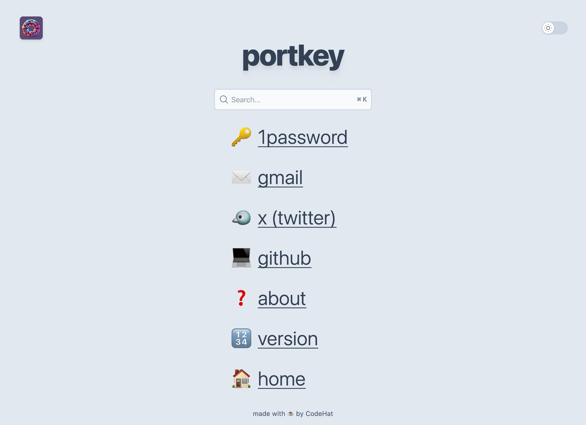
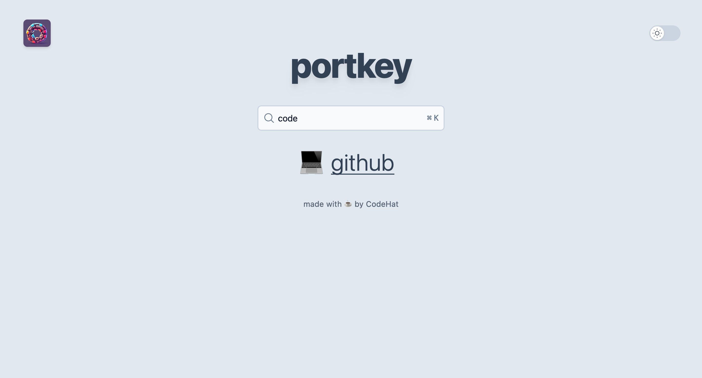
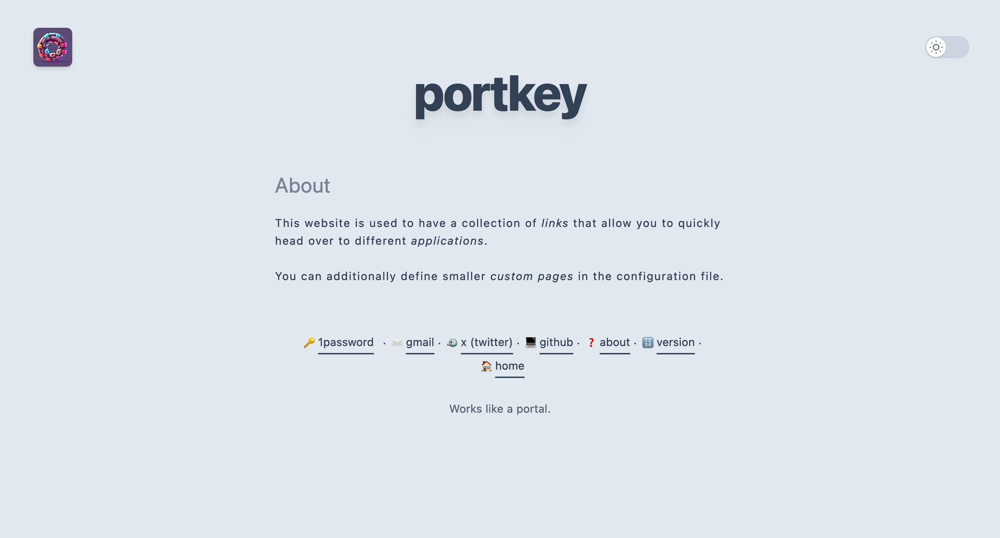

<p style="text-align: center;"></p>

<h1 align="center">portkey</h1>
<div align="center">
  ⚡🚀🔗
</div>
<div align="center">
  <strong>Repository of the portkey application</strong>
</div>
<div align="center">
  A simple web portal that can act as entrypoint for your links/urls. Also supports adding small custom pages.
</div>

<br />

<div align="center">
  <!-- GitHub stars -->
  <a href="https://github.com/kodehat/portkey">
    
  </a>
  <!-- Go version -->
  
  <!-- Docker Hub -->
  <a href="https://travis-ci.org/choojs/choo">
    
  </a>
</div>

<div align="center">
  <h3>
    <a href="https://www.portkey.page">
      Website
    </a>
    <span> | </span>
    <a href="https://github.com/kodehat/portkey/blob/main/.github/CONTRIBUTING.md">
      Contributing
    </a>
  </h3>
</div>

<div align="center">
  <sub>Small web application made with Go. Built with ❤︎ by
  <a href="https://www.codehat.de">CodeHat</a> and
  <a href="https://github.com/kodehat/portkey/graphs/contributors">
    contributors
  </a>
</div>

## Table of Contents

- [Features](#features)
- [Screenshots](#screenshots)
- [Installation](#installation)
- [Usage](#usage)
- [Docker](#docker)
- [Development](#development)
- [See Also](#see-also)
- [License](#license)

## Features

- Show a configurable collection of links.
- Easily add smaller custom pages through configuration.
- Includes a search box that also searches for specific keywords.

## Screenshots

<p>You can also find a demo <a href="https://demo.portkey.page">here</a></p>

<details>

  <summary>Click to view screenshots</summary>

  #### Link collection

  
  
  #### Search for a link

  

  #### Custom page
  
  

</details>

## Installation

Download the `portkey` file for your OS. Probably to a location that is in your `PATH`, so you can use it right away. 

## Usage

1. Create a `config.yml` or use the [example configuration](https://github.com/kodehat/portkey/blob/main/config.yml) from this repository and configure it as you want.
2. Start the application with `portkey --config-path=<path_to_config_yml>`. Providing the path to the configuration file is optional if it's in the working directory.
3. Open browser at defined host and port. Default is <http://localhost:3000>

## Docker

There are also Docker images available at Docker hub that you can use. You can start a container for instance with:

```sh
# Assumes that there is a config.yml in the current directory.
docker run --rm -it -v $(PWD)/config.yml:/opt/config.yml -p 3000:3000 portkey:latest
```

## Development

### Application Code

**portkey** is a *go* application. You can install its dependencies with `go mod download`.

### Frontend

The frontend dependencies (e.g. TailwindCSS, AlpineJS) can be installed with `npm install --include dev`. They can be watched with `npm run watch` and built with `npm run build`.

### Templates

A library called [templ](https://templ.guide) is used for the templates. To generate the `.go` files from the templates, it has to be installed. See [here](https://templ.guide/quick-start/installation) how to do this. Afterwards you can generate the compiled templates with `templ generate`.

## See Also

The whole application is heavily inspired by a theme for the static site generator Hugo. You can find the theme at [victoriadrake/hugo-theme-sam](https://github.com/victoriadrake/hugo-theme-sam). I wanted something more dynamic while also trying out something with Golang and improving in the language.

## License

[AGPL-3.0](https://www.tldrlegal.com/license/gnu-affero-general-public-license-v3-agpl-3-0)